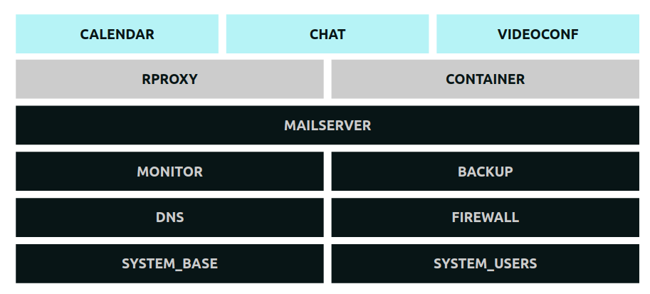

# Galaxie - Clans

## Big picture

## Trunk instances

### Prerequisites

* Debian 10 with ipv4 and ipv6 interface
* SSH access: root or full sudo

### Core services (GREY)

* **NTP**: Based on [ntpd](http://www.ntp.org/)
* **SSH**: Based on [openssh](https://www.openssh.com/)
* **DNS**: Based on [bind](https://www.isc.org/bind/)
* **MAIL**: Based on [postfix](http://www.postfix.org/) & [dovecot](https://www.dovecot.org/)
* **LOGS**: Based on [rsyslog](https://www.rsyslog.com/)
* **METRICS**: Based on [netdata](https://www.netdata.cloud/)
* **BACKUP**: Based on [borg](https://www.borgbackup.org/)

#### Broadcast services (PURPLE)

* **VIDEOCONF**: ``Jitsi``
* **CHAT**: ``Mattermost``
* **R-PROXY** ``nginx``

## Branch instances

### Core services (GREY)

* **Trunk Core Services**
* **TFTP**: Based on `tfpd`
* **PXE**: Based on `pxelinux`
* **DHCP**: Based on `dhcpd`
* **TELEPHONY**: ``asterisk``
* **SHARE**: ``samba``
* **RPITVOS**: ``Libreelec``
* **PVR**: ``TVHeadend``
* **FIREWALL** ``OPNSense``
* **VPN** ``OPNSense``

## Once upon a time...

Once upon a time, this project was hosted on a ancient platform called GitHub. Then came the Buyer. The Buyer bought GitHub, willing to rule over its community. We were not to sell, so here is the new home of "https://github.com/Tuuux/galaxie".

Ansible toolbox aimed at managing a set of Debian servers. Originaly written for managing a Home Network with external services. That is a set of powerfull roles made hand-in-hand by a senior system admin and a senior developer.

Galaxie is a true mix of the two world, by luck author Tuux and Mo have made the necessary to have no compromise.

* Pure System Admin compliance
* Pure Syntax Devs compliance

It will be an honor if you could use our work in any way. Be it as-is or as code samples.
