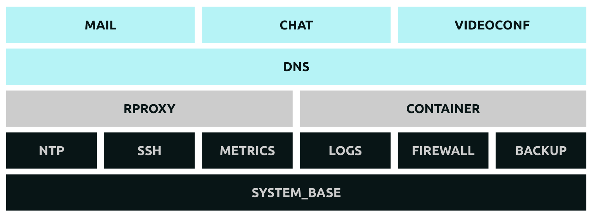

# Galaxie - Clans

> Every gamer needs a clan.
> Find here everything a gamer [clan](https://en.wikipedia.org/wiki/Clan) needs to live in the [Information Age](https://en.wikipedia.org/wiki/Information_Age).

* **Who is it for?**: Litteraly every group of friend willing to communicate over Internet.
* **Why do this?**:
  * Because we can.
  * Because Open-Source is cool.
  * For the fun.

### Host prerequisites

* [Debian Stable](https://www.debian.org/): with ipv4 (and ideally with ipv6 interface too)
* SSH access: as root or full sudo

## Trunk Services

### Big Picture

### Core (BLACK)

Core services are installed at the operating system level.

* **[NTP](roles/ntp/README.md)**: Based on [ntpd](http://www.ntp.org/)
* **[SSH](roles/ssh/README.md)**: Based on [openssh](https://www.openssh.com/)
* **[LOGS](roles/logs/README.md)**: Based on [rsyslog](https://www.rsyslog.com/)
* **[METRICS](roles/metrics/README.md)**: Based on [netdata](https://www.netdata.cloud/)
* **[BACKUP](roles/backup/README.md)**: Based on [borg](https://www.borgbackup.org/)
* **[FIREWALL](roles/firewall/README.md)**: Based on [ufw](https://wiki.debian.org/Uncomplicated%20Firewall%20%28ufw%29)

### High-Level Hub (GREY)

High-level Hub services are installed at the operating system level. These are the mandatory os-level services to build upon for higher-level services.

* **CONTAINER**: Based on [containerd](https://containerd.io/). It is installed at the operating system level. Every higher-level services are to be run by docker-compose-centric system services.
* **RPROXY**: Based on [nginx](https://www.nginx.com/). It is installed at the operating system level. The reverse proxy feature is used to expose
other services by domain name.

#### Broadcast (CYAN)

The following bricks are run as docker-compose files started by a systemd service. Volumes are binded on the host so data can be persisted accross services restart.

* **DNS**: Based on [bind](https://www.isc.org/bind/)
* **MAIL**: Based on [mailu](https://mailu.io/)
* **VIDEOCONF**: Based on [jitsi-meet](https://jitsi.org/jitsi-meet/)
* **CHAT**: Based on [mattermost](https://mattermost.com/)

## Once upon a time...

Once upon a time, this project was hosted on a ancient platform called GitHub. Then came the Buyer. The Buyer bought GitHub, willing to rule over its community. We were not to sell, so here is the new home of "https://github.com/Tuuux/galaxie", and the project has mutated since then...

We build an Ansible toolkit for managing a set of Debian servers, a set of powerful roles made hand-in-hand by a senior system admin and a senior developer.

Originaly written for managing a Home Network with external services. The project has shifted to managing digital survival of clanic entities.

Galaxie is a true mix of the two world, by luck author Tuux and Mo have made the necessary to have no compromise.

Bear in mind folks: Tech purity is cancer of mind.

It will be an honor if you could use our work in any way. Be it as-is or as code samples.
